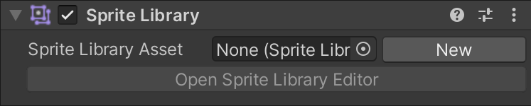
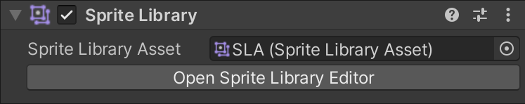
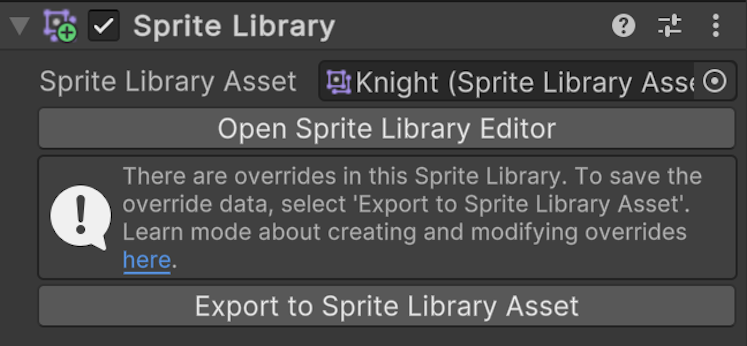

# Sprite Library component in Unity

The **Sprite Library** component defines which [Sprite Library Asset](SL-Asset.md) a GameObject refers to at runtime. When you attach this component to a GameObject, the [Sprite Resolver component](SL-Resolver.md) attached to the same GameObject or child GameObject will refer to the Sprite Library Asset set by the Sprite Library component. This allows you to change the Sprite referenced by a [Sprite Renderer](https://docs.unity3d.com/Manual/class-SpriteRenderer) with the Sprite Resolver component.

## Sprite Library Inspector window

In the Sprite Library component’s Inspector window, assign the desired Sprite Library Asset to the **Sprite Library Asset** property. You can also select **New** to create and save a new Sprite Library Asset which is automatically assigned to the Sprite Library Asset field.

After assigning a Sprite Library Asset, the Inspector window shows a **Open Sprite Library Editor** button.

To edit the contents of a Sprite Library Asset, use the [Sprite Library Editor window](SL-Editor.md).  

## Overriding entries
You can't override Sprite Library entries directly in the **Inspector** window starting from version 9 of the 2D Animation package. To override Sprite Library entries, use these [public methods](xref:UnityEngine.U2D.Animation.SpriteLibrary#methods) instead.

To save the overrides to a separate asset, select **Export to Sprite Library Asset**. The asset is then automatically assigned to the Sprite Library Asset property.

## Additional resources
- [Swapping Sprite Library Assets](SLASwap.md)
- [Overrides to the Main Library](SL-Main-Library.md) 