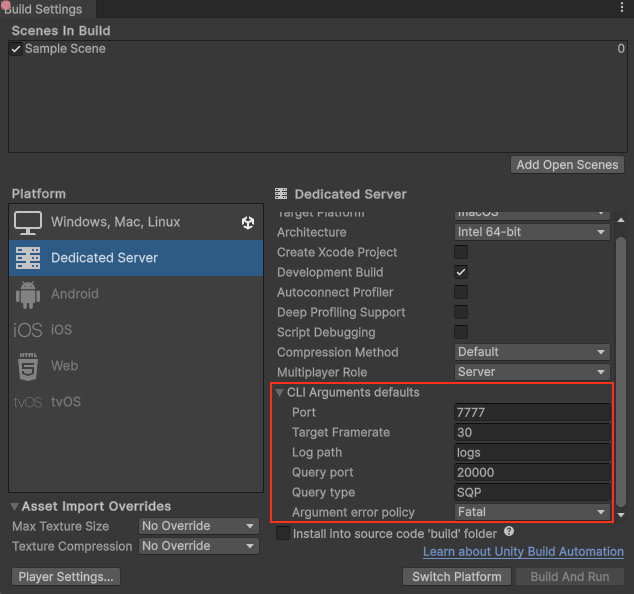

# Set default values for command line arguments

The Dedicated Server package allows to set default values for the command line (CLI) arguments used to launch the game server. These arguments are the same as the command line arguments in the [Multiplay hosting service](https://docs.unity.com/ugs/en-us/manual/game-server-hosting/manual/welcome) which makes a project that uses them compatible with the Multiplay hosting environment.

For more information, refer to the [Dedicated Server arguments documentation](https://docs.unity3d.com/2023.3/Documentation/ScriptReference/DedicatedServer.Arguments.html).

These default values can be set in the Build Settings window for the Dedicated Server platform.

