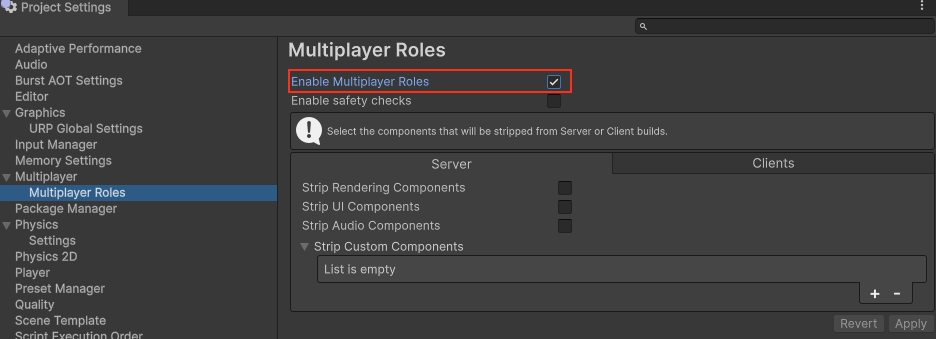
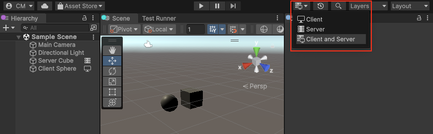
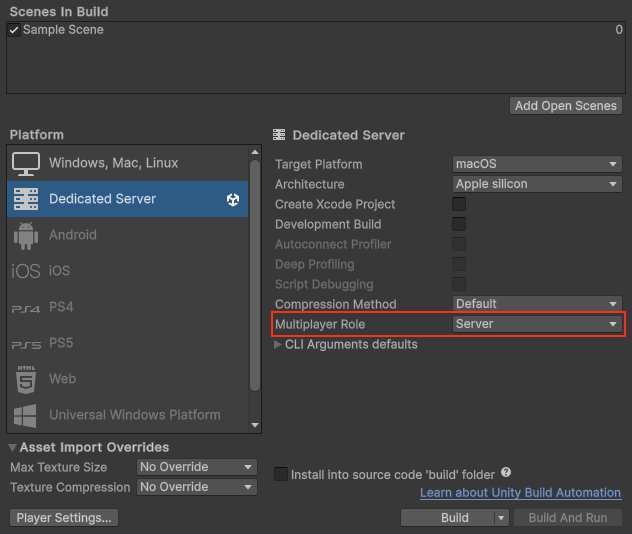

# Multiplayer roles

The Dedicated Server package introduces the concept of Multiplayer Role which describes the different roles that a Unity application can have in a multiplayer game. A game can have the following roles:
* Client role: This role is used by the players to play the game.
* Server role: This role hosts the game and runs the simulation.
* Client/Server role: This default role, also known as a listen server, is a type of server that contains a client.

## Enable multiplayer roles

To enable the feature go to the Project Settings window, select the Multiplayer settings section and enable the Multiplayer Roles option.

When Content Selection is enabled, a new dropdown will appear in the toolbar of the Editor. This dropdown allows to select the multiplayer role to be used when entering play mode.

To specify which multiplayer role should be used when building, go to the Build Settings window and select the target platform. A new Multiplayer Role dropdown allows you to decide which multiplayer role to use for each build target.

