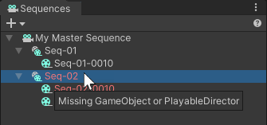

# Hierarchy window

From the Sequences package perspective, the Hierarchy window contains all GameObjects that correspond to the sequences of the Editorial structure you created through the [Sequences window](sequences-window.md). It also contains the GameObjects or Prefabs that represent all the creative content you include in each sequence.

## Editing your Editorial structure

To safely create sequences and edit your editorial structure, you should primarily use the [Sequences window](sequences-window.md).

However, the Sequences package doesn't prevent you from using the Hierarchy window among others to manually solve any sequence functionality issues if you have a good knowledge of the Unity Editor base features.

For general information about the Hierarchy window and the management of GameObjects, see the [Unity Manual](https://docs.unity3d.com/Manual/index.html).

## Converting a Sequence GameObject into a Prefab

You can convert any Sequence GameObject into a Prefab. However, this choice comes with a few side effects you should be aware of. See [how to manage Sequences as Prefabs](sequences-as-prefabs.md).

## Deleting Sequence GameObjects  (not recommended)

The Unity Editor does not prevent you from deleting GameObjects that represent Sequences in the Hierarchy window.

However, as these GameObjects use specific functional assets (Timelines and script) that make them compatible with the Sequences package features, you should preferably [delete your Sequences through the Sequences window](create-and-manage-sequences.md#deleting-sequences) to prevent them from becoming invalid.

 _Example: Sequence and Sequence child that became invalid in the Sequences window after deletion of their GameObjects from the Hierarchy._

### Troubleshooting
* If you just deleted a Sequence GameObject by mistake, immediately use the undo action of the Unity Editor to properly restore the Sequence.
* Otherwise, delete the invalid Sequence from the Sequences window to complete the deletion.
