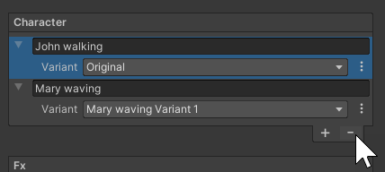

# Populate Sequences with Sequence Assets

## Adding a Sequence Asset

Use this method to add Sequence Assets that you previously created in your Asset Collections.

Select the **+** (plus) button at the bottom of the desired Asset Collection type section, then select the desired Sequence Asset in the list.

>**Note:** If the Sequence where you add the Sequence Asset is a Prefab, you might need to apply overrides from the Prefab instance to the Prefab asset to keep them synchronized. See [how to manage Sequences as Prefabs](sequences-as-prefabs.md).

## Creating a new Sequence Asset in context

Select the **+** (plus) button at the bottom of the desired Asset Collection type section, then select **Create Sequence Asset**.

This action creates the Sequence Asset under the corresponding Asset Collection type and directly adds it to the selected Sequence.

>**Note:** If the Sequence where you add the Sequence Asset is a Prefab, you might need to apply overrides from the Prefab instance to the Prefab asset to keep them synchronized. See [how to manage Sequences as Prefabs](sequences-as-prefabs.md).

## Managing Sequence Asset Variants

Once you added a Sequence Asset to a Sequence, the Sequence Assembly window allows you to select a specific Variant to use. It also allows you to create, duplicate or delete Variants in context.

>**Note:** If you want to swap or delete Sequence Asset Variants in a Sequence that is a Prefab, you might need to enter the Prefab Mode first. See [how to manage Sequences as Prefabs](sequences-as-prefabs.md).

## Removing a Sequence Asset

To remove a Sequence Asset from the current Sequence without deleting it from your Asset Collection, select the area at the left of the Sequence Asset name, and then select the **-** (minus) button at the bottom of the Asset Collection type section.

>**Note:** If you want to remove a Sequence Asset from a Sequence that is a Prefab, you might need to enter the Prefab Mode first. See [how to manage Sequences as Prefabs](sequences-as-prefabs.md).
