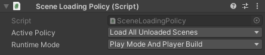
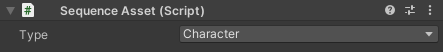
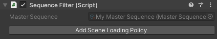

# Reference: Components

This page lists all components that are available through the Sequences package.

## Scene Loading Policy

Use the Scene Loading Policy component to ensure that Unity loads all Scenes that you might have added through [Scene Activation tracks](timeline-window.md#scene-activation-track) when you enter the Play mode or when you run a Player build of your project.

>**Note:** The Scene Loading Policy has no effect on the current Scene loading status in Edit mode.

| Property || Description |
|---|---|---|
| **Active Policy** |  | The Scene loading policy to apply in the targeted **Runtime Mode** to any unloaded Scene of the current Master Sequence. |
|  | Do Not Load Unloaded Scenes | Unity does not load any Scenes that are not already loaded. |
|  | Load All Unloaded Scenes | Unity loads all Scenes that are part of the current Master Sequence structure. |
| **Runtime Mode** |  | The runtime mode(s), for instance, the Play mode, the Player build, or both, to apply the **Active Policy** to. |
|  | Play Mode Only | Applies the policy only when you enter the Play mode. |
|  | Player Build Only \* | Applies the policy only when you run a Player build of your project. |
|  | Play Mode And Player Build \* | Applies the policy when you enter the Play mode and when you build a Player from your project. |

_\* These options automatically update the Scene list in the [Build Settings](https://docs.unity3d.com/Manual/BuildSettings.html) to make sure that you include all necessary Scenes when you build your project._

You can add this component to any Sequence, but the best practice is to add it to the Master Sequence. Also, you should define only one Scene Loading Policy per Master Sequence hierarchy.

If you don't add a Scene Loading Policy component to your Master Sequence hierarchy, Unity doesn't load any unloaded Scene when you enter the Play mode or when you run a Player build of your project, even if you include the Scenes in the [Build Settings](https://docs.unity3d.com/Manual/BuildSettings.html).

## Sequence Asset

A Prefab or a Prefab Variant that has a Sequence Asset component represents a Sequence Asset usable in a Sequence.

| Property | Description |
|---|---|
| **Type** | The [Asset Collection type](concepts.md#asset-collections) the Sequence Asset belongs to.  **Note:** Unity automatically assigns the value of this property when you create a Sequence Asset from the [Sequence Assets window](sequence-assets-window.md). You shouldn't change it unless you exactly know what you're doing. |

## Sequence Filter

A GameObject that has a Sequence Filter component represents a Sequence in the Hierarchy.

| Property/Button | Description |
|---|---|
| **Master Sequence** | The Master Sequence script asset that holds and manages the whole Sequence structure within the current Master Sequence. This property is read-only. |
| **Add Scene Loading Policy** | Adds a [Scene Loading Policy](#scene-loading-policy) component to the current Sequence. |
