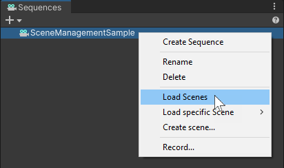
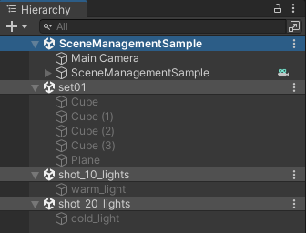
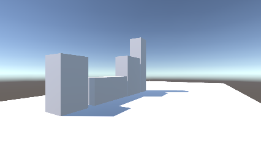
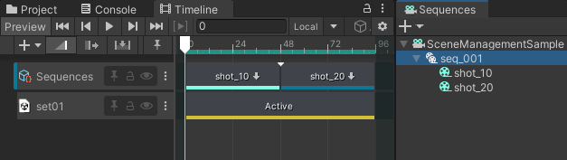
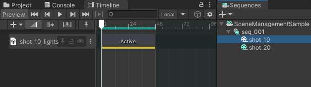
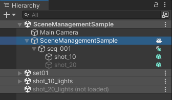
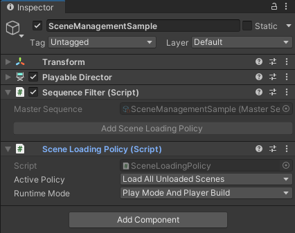

# Scene Management (sample)

Use this sample to practice with Scene Activation tracks and Scene loading features in Sequences.

>**Before you begin:** Make sure to have the [Sequences](sequences-window.md) and [Timeline](timeline-window.md) windows open in the Editor.

## Getting the sample

To get and open the sample:

1. Open the Package Manager and select the **Sequences** package in the list.

2. In the right pane, expand the **Samples** section and next to **Scene Management**, click on **Import**.

3. In the Project window, from the `Assets/Samples/Sequences/.../Scene Management` folder, open the `SceneManagementSample.unity` Scene.

## Testing the sample

The sample demonstrates the possibility to activate/deactivate separate Scenes through a simple Sequences structure. To be able to see the Scene activation/deactivation effects in the Unity Editor, it is necessary to first load the targeted Scenes.

To load the Scenes and test the sample:

1. In the Sequences window, right click on **SceneManagementSample** and select **Load Scenes**.

  

2. In the Hierarchy, notice the three new loaded Scenes: **set01.unity**, **shot_10_lights.unity** and **shot_20_lights.unity**.

  

3. In the Timeline window, hit the Play button or scrub the playhead to observe how the various Scenes are activated and deactivated throughout the Master Sequence.

  

  * The **set01.unity** Scene (four cubes on a plane) remains active all the time.
  * The **shot_10_lights.unity** Scene (lighting the set from the left) is active only during the first half of the Master Sequence.
  * The **shot_20_lights.unity** Scene (lighting the set from the right) is active only during the second half of the Master Sequence.

## Understanding scene activation

The activation/deactivation of each Scene in the sample is driven through a Scene Activation track in Timeline.

1. In the Sequences window, expand **SceneManagementSample** and select **seq_001**.

  

  In the Timeline window, the yellow track named **set01** is a Scene Activation track. It drives the activation of the **set01.unity** Scene during the **seq_001** Sequence time range.

2. In the Sequences window, expand **seq_001** and select **shot_10**.

  

  In the Timeline window, notice that **shot_10** also has a Scene Activation track. This track drives the activation of the **shot_10_lights.unity** Scene during the **shot_10** Sequence time range.

3. In the Sequences window, select **shot_20**, and notice it also has a Scene Activation track. This track drives the activation of the **shot_20_lights.unity** Scene during the **shot_20** Sequence time range.

>**See also:**
>* [Setting up Scene activation in a Sequence](scene-management.md#setting-up-scene-activation-in-a-sequence)
>* [Scene Activation track in Timeline](timeline-window.md#scene-activation-track).

## Understanding scene loading

A Scene Activation track can't activate a Scene if this Scene isn't first loaded. You can load Scenes in the Unity Editor through the Sequences structure, but you can also set up a Scene Loading policy that automatically loads Scenes when you enter the Play mode or when you run a Player build of your project.

>**Note:** This sample was not designed for being built as a standalone player. To avoid unwanted behaviors, don't try to run a Player build with it.

To understand how a Scene Loading Policy works in the Play mode context:

1. In the Hierarchy, right-click on the **shot_20_lights.unity** Scene and select **Unload Scene**.

2. In the Sequences window, select **seq_001**, and in the Timeline window, hit the Play button or scrub the playhead.

  Notice the **shot_20_lights.unity** Scene is no longer activated when you reach the **shot_20** Sequence.

3. In the Hierarchy, in the **SceneManagementSample** Scene, select the **SceneManagementSample** GameObject.

  

4. In the Inspector, in the **Sequence Filter** component, click on **Add Scene Loading Policy**.

  

  This adds the **Scene Loading Policy** component. Leave the properties set to their default values.

5. Enter the Play mode.

  Notice the **shot_20_lights.unity** Scene automatically loads in the Hierarchy at the beginning, and activates when expected.

6. Exit the Play mode.

  Notice the **shot_20_lights.unity** Scene is unloaded, as it was before you entered the Play mode.

>**See also:**
>* [Loading Scenes contextually](scene-management.md#loading-scenes-contextually)
>* [Setting up a Scene Loading Policy](scene-management.md#setting-up-a-scene-loading-policy)
>* [Scene Loading Policy component](ref-components.md#scene-loading-policy)
