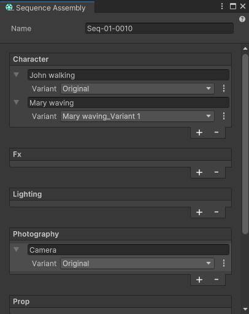
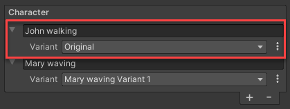

# Sequence Assembly window

The Sequence Assembly window allows you to populate your Sequences with Sequence Assets and swap Sequence Asset Variants. From this window, you can also create and manage Sequence Assets and Variants in context.

To open the Sequence Assembly window, from the main menu of the Editor, select **Window > Sequencing > Sequence Assembly**.

## Properties

The Sequence Assembly window acts as a simplified Inspector which displays the properties of the Sequence currently selected in the [Sequences window](sequences-window.md), and allows you manage the Sequence Assets you want it to contain.

| **Property** | **Description** |
|--------------|-----------------|
| **Name** | The name of the Sequence currently selected in the [Sequences window](sequences-window.md).  **Note:** If you want to rename the Sequence, use the Sequences window. |
| **Character**, **Fx**, **Lighting**, **Photography**, **Prop**, **Set**, **Audio** | These sections correspond to the Asset Collection types available in the [Sequence Assets window](sequence-assets-window.md).  Through each section, you can add and edit Sequence Assets of the corresponding Asset Collection type for the selected Sequence. |

| **Property** || **Description** |
|:---|:---|:---|
| Name field || The name of the Sequence Asset.  You can rename the Sequence Asset through this field. The new name is applied everywhere the Sequence Asset appears in the Editor.  To rename the Sequence Asset, click on its field, type the new name, press Enter, and then click **Rename** to confirm the change. |
| **Variant** || Use this list to select the Sequence Asset Variant that you want to use in the selected Sequence, if the Sequence Asset has Variants.  By default, the Sequence Assembly window sets this property to "Original", which corresponds to the base Sequence Asset. |
| Options button ( **⋮** ) || Allows you to create, duplicate, and delete Sequence Asset Variants in context. |
|| Create new variant | Creates a new Variant from the current Sequence Asset.  If you want to use this Variant in the current Sequence, you must still select it in the **Variant** list. |
|| Duplicate current variant | Creates a duplicate of the currently selected Variant.  If you want to use this Variant in the current Sequence, you must still select it in the **Variant** list. |
|| Delete current variant | Permanently deletes the currently selected Variant from your Unity project.  Once the Variant is deleted, the selection in the **Variant** list automatically falls back to the original Sequence Asset. |
