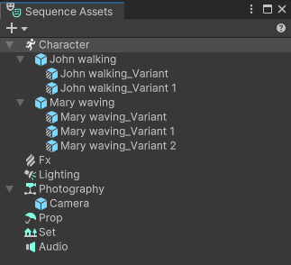

# Sequence Assets window

Use the Sequence Assets window to create and manage categorized [Sequence Assets and Variants](concepts.md#sequence-assets) that you can use in your Sequences.

To open the Sequence Assets window, from the main menu of the Editor, select **Window > Sequencing > Sequence Assets**.

The Sequence Assets window allows you to create and organize Sequence Assets and Variants, which represent the actual creative content that you can use in your Sequences.
