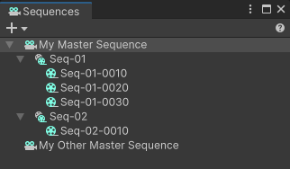

# Sequences window

Use the Sequences window to create, organize and browse through the [Editorial structure](concepts.md#editorial) of the Sequences you’re working on.

To open the Sequences window, from the main menu of the Editor, select **Window > Sequencing > Sequences**.

The Sequences window mainly allows you to:

* [Set up the overall structure](create-and-manage-sequences.md#creating-a-sequence) of your cinematics.

* [Browse through all Sequences](#browsing-through-sequences) that compose your cinematics.

Additionally, from this window:

* You can manage the [activation of additional Scenes](scene-management.md#setting-up-scene-activation-in-a-sequence) in the context of specific Sequences.

* You can access the Unity Recorder to [record any Sequence](export.md#recording-a-sequence) and export it, for example, to a video file.

## Browsing through Sequences

When you select a Sequence:

* The [Sequence Assembly window](sequence-assembly-window.md) displays the properties of the selected Sequence. This is where you can add Sequence Assets to the selected Sequence.

* The [Timeline window](timeline-window.md) displays the tracks contained in the selected Sequence. This is where you can trim and reorder the clips within the selected Sequence.

>**Note:** If you open a Sequence in Prefab Mode, you can only browse through the structure of this Sequence. See [how to manage Sequences as Prefabs](sequences-as-prefabs.md).
