# Timeline window

In the context of the Sequences package, the Timeline window allows you to edit, reorder and trim all Sequences and clips of your cinematic, and play them back for preview purposes.

To open the Timeline window, from the main menu of the Editor, select **Window > Sequencing > Timeline**.

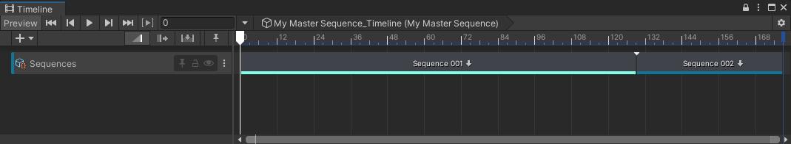

>**Note:** This page only provides straightforward instructions to guide you through the specific use of the Sequences features available from the [Timeline](https://docs.unity3d.com/Packages/com.unity.timeline@latest) window.

## Navigation

When you navigate through your Sequences from the Sequences window or from the Hierarchy window, the Timeline window displays the Timeline of the current selected Sequence.

You can also navigate through your Sequences from the Timeline window:

* Double click on any clip that represents an element of your Editorial structure to access its Timeline (at the lower level of the structure).

* The breadcrumb trail at the top of the Timeline window allows you to access any parent Timeline of the currently displayed one.

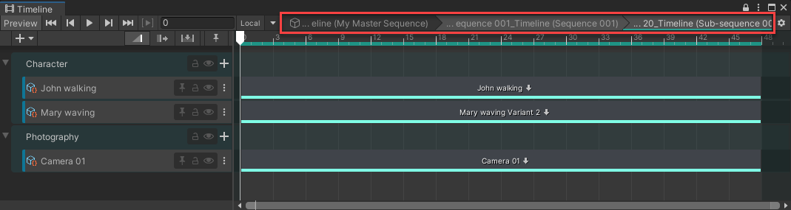

>**Note:** If you open a Sequence in Prefab Mode, you can only navigate through the structure of this Sequence. See [how to manage Sequences as Prefabs](sequences-as-prefabs.md).

## Timeline track types

### Editorial track

When a Sequence contains other Sequences, its Timeline includes an **Editorial** track with clips that represent the Sequences it contains.

 *Example: In a Master Sequence timeline, the Editorial track (here, named "Sequences") with two Sequence clips.*

You can double-click on a Sequence clip to access the Timeline of this Sequence at the immediate sub-level of the structure.

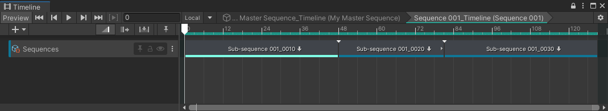
 *Example: In a Sequence timeline of 2nd level, the Editorial track (here, named "Sequences") with three Sequence clips.*

The Sequences package automatically creates and configures Editorial tracks when you create Sequences through the Sequences window.

>**Note:** You can manually create an Editorial track through the Timeline Add Track menu: select the **+** (plus) button or right-click in an empty area of the track list, and then select **Sequencing > Editorial Track**. However, such a track would require some more advanced configuration to become usable in the context of Sequences.

### Sequence Asset track

When a Sequence contains Sequence Assets, its Timeline includes one track per Sequence Asset, all regrouped by Asset Collection type.

Each Sequence Asset track includes a unique clip that represents the Sequence Asset or Variant that you are currently using in your cinematic.

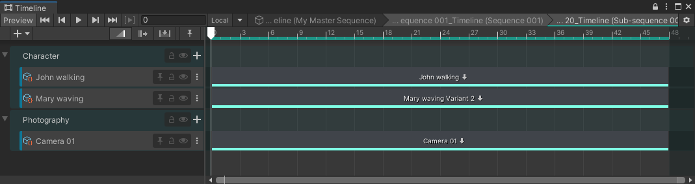
 *Example: Timeline of a Shot with three Sequence Asset tracks in their corresponding Asset Collection track groups: two characters and one camera.*

You can double-click on each clip to directly access the Timeline of the corresponding Sequence Asset or Variant, and edit it.

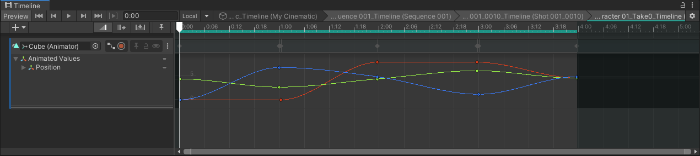
 *Example: Timeline of a Sequence Asset with a simple animation clip.*

The Sequences package automatically creates and configures Sequence Asset tracks when you add Sequence Assets to a Sequence through the Sequence Assembly window or through the Hierarchy.

>**Note:** You can manually create a Sequence Asset track through the Timeline Add Track menu: select the **+** (plus) button or right-click in an empty area of the track list, and then select **Sequencing > Sequence Asset Track**. However, such a track would require some more advanced configuration to become usable in the context of Sequences.

### Scene Activation track

When a Sequence uses a Scene that needs to be activated in its specific context, the Timeline of this Sequence includes a Scene Activation track.

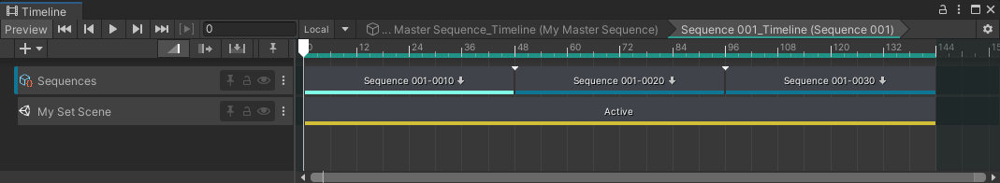
 *Example: Timeline of a Sequence with one Scene Activation track.*

>**Important:** To actually see a Scene in your Scene and Game views when Unity activates it through a Scene Activation track, you must ensure to have previously additively loaded it along with the Scene that contains your Sequences structure. For convenience, the Sequences package allows you to [load Scenes in context](scene-management.md#loading-scenes-contextually).

The Sequences package automatically creates and configures Scene Activation tracks when you create a Scene for a Sequence through the Sequences window.

You can also manually create and configure a Sequence Asset track through the Timeline Add Track menu:

1. Select the **+** (plus) button or right-click in an empty area of the track list, and then select **Scene Activation Track**.

2. Select the created track in the track list.

3. In the Inspector, use the **Scene** field to target an existing Scene.

   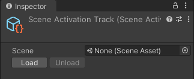

4. Select **Load** if you need to load the targeted Scene in the Hierarchy, in addition to the Scene that contains your Sequences.

## Managing clips

### Moving and trimming clips

You can [move](https://docs.unity3d.com/Packages/com.unity.timeline@1.6/manual/clp_position.html) and [trim](https://docs.unity3d.com/Packages/com.unity.timeline@1.6/manual/clp_trim.html) any Sequence, Sequence Asset and Scene Activation clips within the Timeline track that contains them, as any other Timeline clip type.

>**Note:** The actual behavior of these actions depends on the [clip edit mode](https://docs.unity3d.com/Packages/com.unity.timeline@1.6/manual/clp_about.html#clip-edit-modes) currently selected in Timeline.

| Example: Trimmed Sequence clip |
|:---|
| The arrow tips at the left and at the right of the clip indicate that the Sequence is trimmed at both the start and the end.  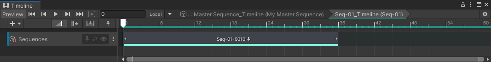  In the clip content, notice how the highlighted area shows the actual used portion of the sequence.  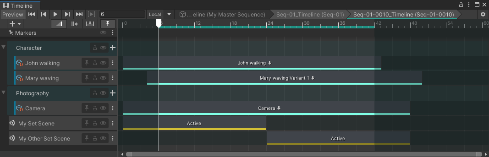 |

### Matching a clip to its overall content

You can automatically adjust the length of any clip to [match its content](https://docs.unity3d.com/Packages/com.unity.timeline@1.6/manual/clp_about.html#clips-and-the-clips-view) overall, that is, the range that includes all immediate sub-items of the clip, regardless of their type.

* To adjust the length of any clip to match its content overall:
  1. Right click on the clip.
  2. select **Match Content**.

>**Note:** The actual behavior of this action depends on the [clip edit mode](https://docs.unity3d.com/Packages/com.unity.timeline@1.6/manual/clp_about.html#clip-edit-modes) currently selected in Timeline.

| Example: Match Content on Sequence clip |
|:---|
| **Before:** Seq-01 clip (frames 0 to 72) is shorter than its actual content. In the clip content, notice that its largest sub-item, the AudioAsset clip, covers 144 frames.  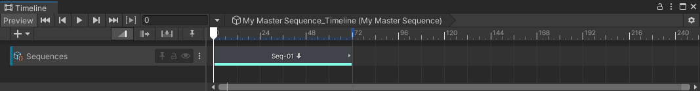  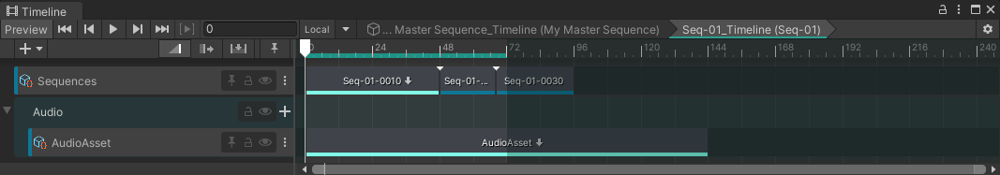  |
| **After:** Seq-01 clip covers frames 0 to 144.  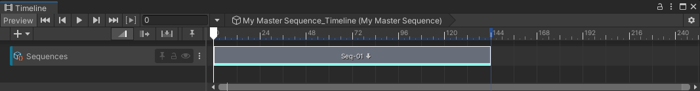 |

### Matching a Sequence clip to its editorial content

You can automatically adjust the length of Sequence clips to exclusively match their editorial content, that is, only the Sequence clips from their immediate sub-level.

>**Note:** This content matching process ignores any sub-items that are not Sequence clips. If the targeted Sequence contains clips of any other types that are longer than the total length of the sub-sequences, the process automatically cuts off the end of these clips. This is equivalent to selectively trimming the Sequence.

* To adjust the length of **a single Sequence clip** to match its editorial content:
  1. Right click on the Sequence clip.
  2. Select **Match Editorial Content (Ripple)**.

You can also perform the same action in batch at the track level.

* To adjust the length of **all Sequence clips in a track** to match their editorial content:
  1. Right click on the Editorial track that contains the Sequence clips.
  2. Select **Match Editorial Content (Ripple)**.

>**Note:** In both cases, this action uses the [Ripple mode](https://docs.unity3d.com/Packages/com.unity.timeline@1.6/manual/clp_about.html#ripple-mode) behavior, regardless to the selected mode in the Timeline view.

| Example: Match Editorial Content on single Sequence clip |
|:---|
| **Before:** Seq-01 clip (frames 0 to 72) is shorter than its actual editorial content (3 sequence clips covering 96 frames). In the clip content, notice the additional AudioAsset clip that covers a larger range and is not a Sequence clip. Also remember that Match Editorial Content ignores clips that are not Sequence clips.  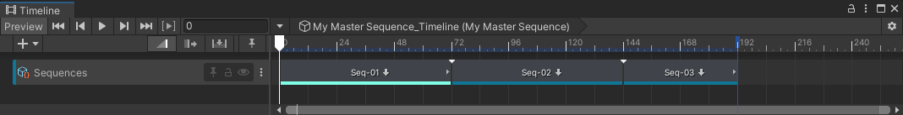  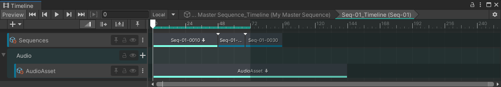  |
| **After:** Seq-01 clip covers frames 0 to 96, and Seq-02 and Seq-03 clips accordingly shifted to the right. Notice the process ignored the AudioAsset clip length because it's not a Sequence clip.  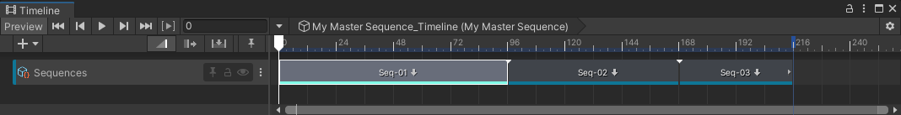 |

| Example: Match Editorial Content on Editorial track |
|:---|
| **Before:** Let's assume Seq-01 and Seq-03 clips are shorter than their actual editorial content, and Seq-02 clip is longer than its own one.    |
| **After:** All 3 clips match their editorial content according to the above assumption, and the overall adjustment kept the continuity of the whole editorial track.  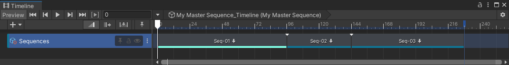 |
