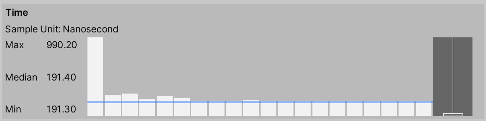
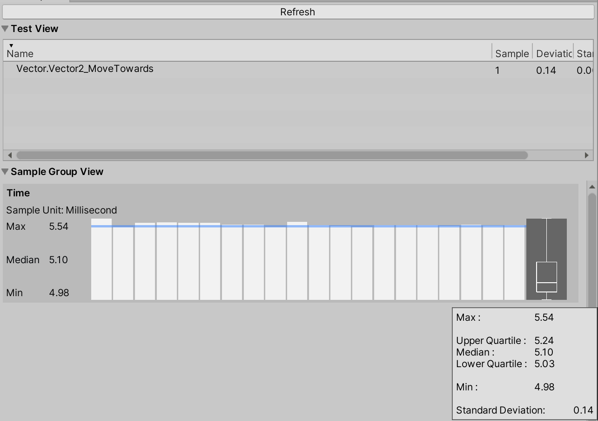

# Writing a simple test

This example uses `Measure.Method` to measure the performance of Vector2 operations. This executes the provided method and samples performance. Increasing `MeasurementCount` from the default of 7 to 20 improves performance test stability. You can execute a `Vector2.MoveTowards` test in Edit Mode or Play Mode. 

``` csharp
[Test, Performance]
public void Vector2_operations()
{
    var a = Vector2.one;
    var b = Vector2.zero;

    Measure.Method(() =>
    {
            Vector2.MoveTowards(a, b, 0.5f);
            Vector2.ClampMagnitude(a, 0.5f);
            Vector2.Reflect(a, b);
            Vector2.SignedAngle(a, b);
    })
        .MeasurementCount(20)
        .Run();
}
```

To view the results, go to **Window > Analysis > Performance Test Report**.



In this example, the results show that the first method execution took five times longer than the subsequent methods, and those subsequent method executions were unstable. Also, you can't tell from these test results how long it took for each Vector2 operation to execute.

## Improving test stability

Now we'll look at how to improve the stability of our test. Instability can occur at the beginning of a test for several reasons, such as entering Play Mode or method initialization, because the tested method is quite fast and more sensitive to other running background processes. 

To improve stability, use `WarmupCount(n)`. This allows you to execute methods before recording data, so Unity doesn't record method initialization. The simplest way to increase test execution time is to repeat the method in a loop.
Avoid having measurements that are less than 1ms because they are usually more sensitive to unstable environments.

To help you track the execution time for each operation, split the Vector2 operations into several tests. Often, when writing tests, we use setup and clean up methods to isolate the test environment. However, in this case, methods are isolated and do not affect other methods, so we don't need a cleanup or setup.
The following code example shows a performance test for the `Vector2.MoveTowards` operation. Other Vector2 performance tests are identical.

``` csharp
[Test, Performance]
public void Vector2_MoveTowards()
{

    Measure.Method(() =>
    {
        Vector2.MoveTowards(Vector2.one, Vector2.zero, 0.5f);
    })
        .WarmupCount(5)
        .IterationsPerMeasurement(10000)
        .MeasurementCount(20)
        .Run();
}
```

With 100000 iterations in this test, we see a small fluctuation in method execution time but the standard deviation is low, which means the test is reasonably stable.



## Measure a Play Mode only method

To measure a method that only runs in Play Mode (for example `Physics.Raycast`), you can use `Measure.Frames()`, which records time per frame by default. To only measure `Physics.Raycast` time, you can disable frame time measurements with `DontRecordFrametime` and just measure the `Physics.Raycast` profiler marker.
This test creates objects that you need to dispose of at the end of each test, because multiple unnecessary objects can affect the next test results. Use the SetUp method to create GameObjects, and the TearDown method to destroy the created GameObjects after each test. 

``` csharp
[SetUp]
public void SetUp()
{
    for (int i = 0; i < 100; ++i)
    {
        GameObject raycaster = new GameObject("raycast", typeof(Raycast));
        raycaster.transform.SetParent(_parent.transform);
    }
}

[UnityTest, Performance]
public IEnumerator Physics_RaycastTests()
{
    string profilierMarker = "Physics.Raycast";
    
    yield return Measure.Frames()
        .WarmupCount(3)
        .DontRecordFrametime()
        .MeasurementCount(10)
        .ProfilerMarkers(profilierMarker)
        .Run();
}

public class Raycast : MonoBehaviour
{
    private void Update()
    {
        RaycastHit hit;
        bool ray = Physics.Raycast(
            transform.position, 
            Vector3.forward, 
            out hit, 
            Mathf.Infinity);
    }
}

[TearDown]
public void TearDown()
{
    GameObject.DestroyImmediate(_parent);
}
```

To record your own measurements, create a new sample group and record a custom metric. The following example measures `Allocated` and `Reserved` memory.

``` csharp
[Test, Performance]
public void Empty()
{
    var allocated = new SampleGroup("TotalAllocatedMemory", SampleUnit.Megabyte);
    var reserved = new SampleGroup("TotalReservedMemory", SampleUnit.Megabyte);

    using (Measure.Scope())
    {
        Measure.Custom(allocated, UnityEngine.Profiling.Profiler.GetTotalAllocatedMemoryLong() / 1048576f);
        Measure.Custom(reserved, UnityEngine.Profiling.Profiler.GetTotalReservedMemoryLong() / 1048576f);
    }
}
```

Before you start to collect package performance data, make sure the tests you run locally are stable (the data set deviation is <5%). In the **Performance Test Report** window, ensure the test isn't fluctuating and that the results between runs are similar. 

Results of performance tests run on a local machine can be significantly different to previous test runs because of other applications running in the background, CPU overheating, or CPU boosting. Make sure that CPU intensive applications are turned off where possible. You can disable CPU boost in the BIOS or with third-party software such as Real Temp.

For comparing performance data between runs, use the [Unity Performance Benchmark Reporter](https://github.com/Unity-Technologies/PerformanceBenchmarkReporter/wiki), which provides a graphical HTML report that enables you to compare performance metric baselines and subsequent performance metrics.

## Further examples

#### Example 1: Measure execution time to serialize simple object to JSON

``` csharp
    [Test, Performance, Version("2")]
    public void Serialize_SimpleObject()
    {
        var obj = new SimpleObject();
        obj.Init();

        Measure.Method(() => JsonUtility.ToJson(obj)).Run();
    }

    [Serializable]
    public class SimpleObject
    {
        public int IntField;
        public string StringField;
        public float FloatField;
        public bool BoolField;

        [Serializable]
        public struct NestedStruct
        {
            public int A, B;
        }

        public NestedStruct Str;

        public Vector3 Position;

        public void Init()
        {
            IntField = 1;
            StringField = "Test";
            FloatField = 2.0f;
            BoolField = false;
            Str.A = 15;
            Str.B = 20;
        }
    }
```


#### Example 2: Measure execution time to create 5000 simple cubes

``` csharp
    string[] markers =
    {
        "Instantiate",
        "Instantiate.Copy",
        "Instantiate.Produce",
        "Instantiate.Awake"
    };

    [Test, Performance]
    public void Instantiate_CreateCubes()
    {
        using (Measure.ProfilerMarkers(markers))
        {
            using(Measure.Scope())
            {
                var cube = GameObject.CreatePrimitive(PrimitiveType.Cube);
                for (var i = 0; i < 5000; i++)
                {
                    UnityEngine.Object.Instantiate(cube);
                }
            }
        }
    }
```

#### Example 3: Scene measurements

``` csharp
    [UnityTest, Performance]
    public IEnumerator Rendering_SampleScene()
    {
        using(Measure.Scope("LoadScene"))
        {
            // Add scene to Build Settings before running test 
            SceneManager.LoadScene("SampleScene"); 
        }
        yield return null;

        yield return Measure.Frames().Run();
    }
```

#### Example 4: Custom measurement to capture total allocated and reserved memory

``` csharp
    [Test, Performance, Version("1")]
    public void Measure_Empty()
    {
        var allocated = new SampleGroup("TotalAllocatedMemory", SampleUnit.Megabyte);
        var reserved = new SampleGroup("TotalReservedMemory", SampleUnit.Megabyte);
        Measure.Custom(allocated, UnityEngine.Profiling.Profiler.GetTotalAllocatedMemoryLong() / 1048576f);
        Measure.Custom(reserved, UnityEngine.Profiling.Profiler.GetTotalReservedMemoryLong() / 1048576f);
    }
```